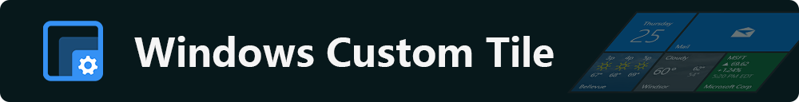

# Windows Custom Tile

个性化你的Windows开始菜单磁贴

  
[主页](https://repo.fischldesu.com/WindowsCustomTile) /
[开发博客](https://blog.fischldesu.com/?p=windows-live-tile)  
Windows Custom Tile 是一款可以让你快速个性化、自定义 Windows开始菜单磁贴的软件  
通过封装与集成原生API来实现磁贴内容变更。软件使用 `WinUI 3` 详细请看 [Wiki](https://github.com/fischldesu/WindowsCustomTile/wiki) 中的介绍。
本软件 MIT 完全开源，若有任何建议或改进意见、遇到任何BUG，请直接提`issue`或是在我的`Bilibili`给我留言  
[使用教程](https://repo.fischldesu.com/WindowsCustomTile/wiki) /
[Bilibili](https://www.bilibili.com/video/BV1T83ozJETg) /
[发布](https://github.com/fischldesu/WindowsCustomTile/releases)

### 技术栈
`.NET`
`WindowsAppSDK`
`WinUI 3`
`WinRT`

### 软件安装

[软件下载](https://github.com/fischldesu/WindowsCustomTile/releases) /
[Gitee](https://gitee.com/fischldesu/WindowsCustomTile/releases)  
一个`WindowsCustomTile_xxx_x64.msix`安装包  
一个证书文件`WindowsCustomTile_xxx_x64.cer`  
1. 准备安装证书 打开证书，点击安装证书，选择【本地计算机】
2. 选择【将所有的证书都放入下列存储】位置选择【受信任的根证书颁发机构】
3. 打开`WindowsCustomTile_xxx_x64.msix`安装应用程序

部分情况需打开`开发者模式` 更多详细内容 [点击此处查看](https://repo.fischldesu.com/WindowsCustomTile/wiki/more#install)
### 基本使用说明

请先固定磁贴到开始菜单，并启动本App

1. 在你的电脑中选择一张你喜欢图片  
2. 拖入到【图片磁贴】下方的四个预览框  
3. 需要展示说明尺寸，就请拖入到哪个尺寸预览框  
4. 点击【确认】按钮，并查看磁贴是否已经更新  

更多教程内容请 [点击查看](https://repo.fischldesu.com/WindowsCustomTile/wiki)

⚠️ 由于`Windows11`取消了开始菜单磁贴，若要使用磁贴  
推荐使用三方软件“调出Win10遗留的”开始菜单：  
[Github@valinet/ExplorerPatcher](https://github.com/valinet/ExplorerPatcher)
> [!CAUTION]  
> 在 Windows 11 中磁贴功能已经被弃用，但微软并未完全删除改功能，可以通过其他软件将其调出 使用户可以在 Windows 11中也能使用 Windows 10 的磁贴，我推荐使用的是该软件 [valinet/ExplorerPatcher](https://github.com/valinet/ExplorerPatcher)，此软件功能强大且作者一直在更新，但毕竟是第三方软件，与其他美化软件可能会有兼容性等问题存在。

   
This software codes are licensed under the MIT License.
 
© fischldesu 2025
